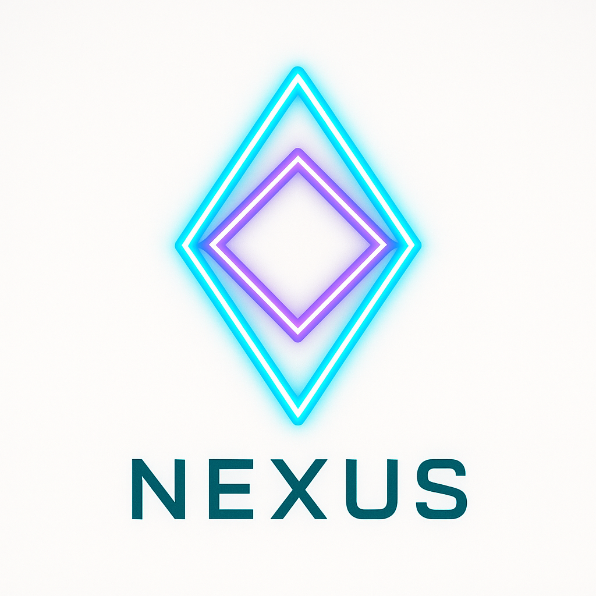
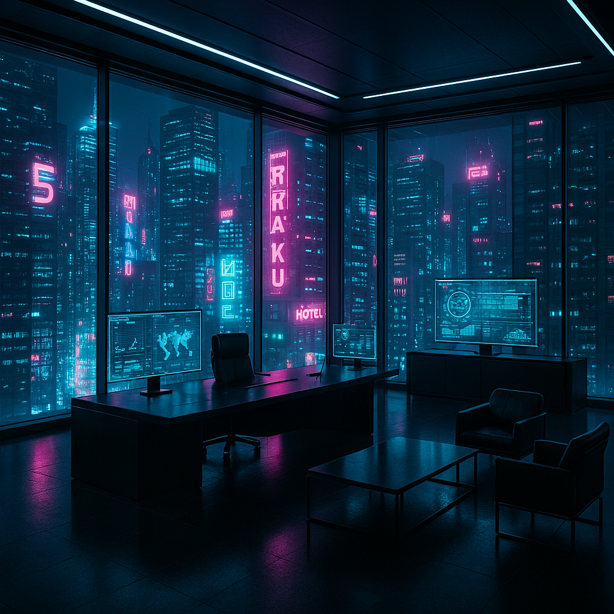
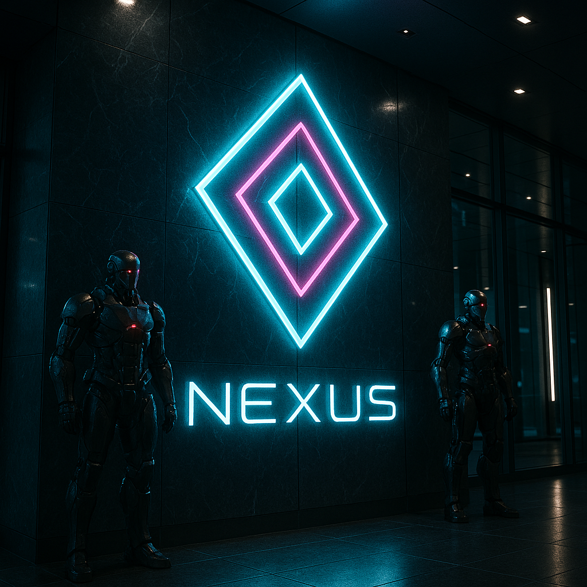
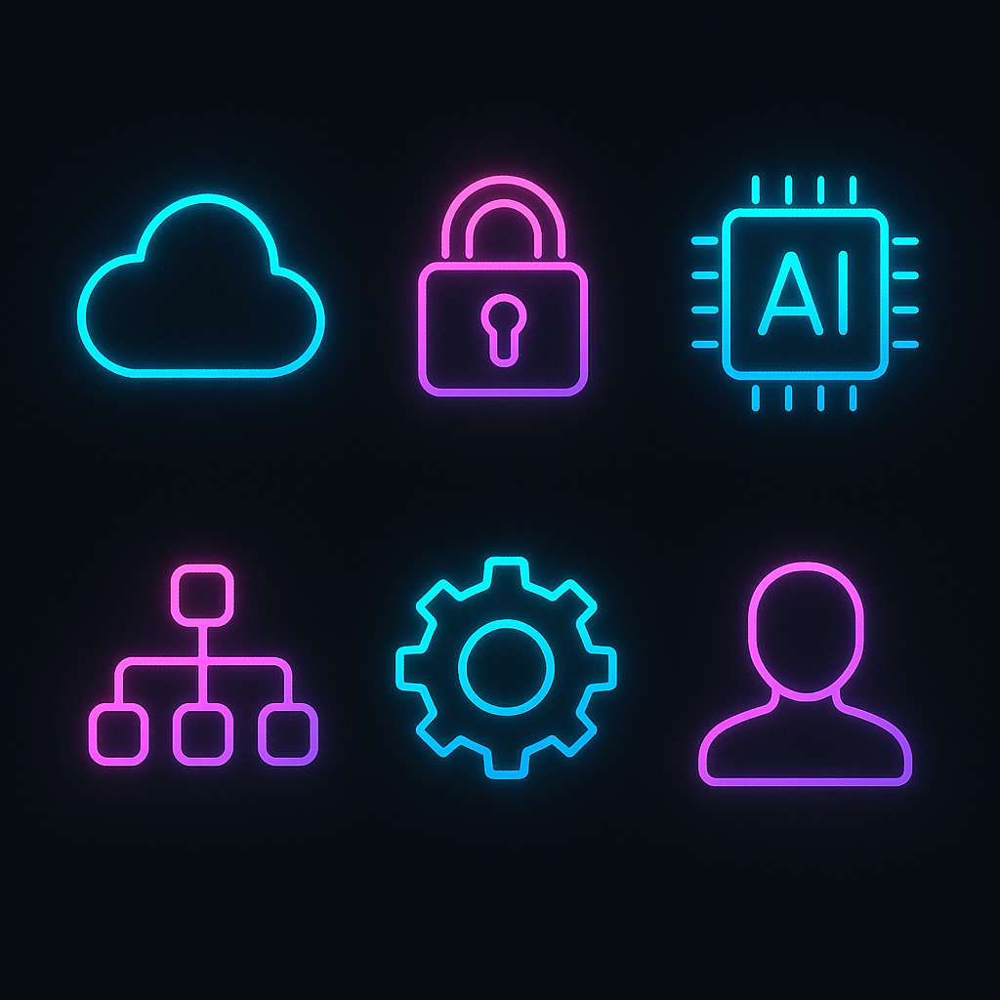

# Task 2: The Creative Visionary 

## Project Overview
This project involved rebranding a tech startup named **'Nexus'** using a unique **"Cyberpunk-Corporate"** aesthetic. The goal was to generate high-fidelity, brand-consistent visual assets that merge futuristic neon elements with a professional, sleek corporate atmosphere.

## The Vision
- **Aesthetic:** Cyberpunk-Corporate (Neon Cyan & Magenta accents + Minimalist Obsidian & Glass).
- **Style Consistency:** Maintaining a specific color palette and lighting across different types of assets.
- **Tools Used:** DALL-E 3 (via Microsoft Designer).

## Visual Assets & Exact Prompts Used

### 1. Logo Concept
**Prompt:** A minimalist futuristic logo for a tech startup named 'Nexus', geometric shape, cyberpunk aesthetic, glowing cyan and violet neon lines, vector style, white background, high quality, 8k.

### 2. Hero Image (Executive Office)
**Prompt:** Cinematic wide shot of a futuristic cyberpunk corporate office interior, giant glass windows showing a neon city at night, holographic displays, sleek obsidian furniture, professional atmosphere, cyan and magenta lighting, hyper-realistic, 8k, unreal engine 5 render.

### 3. Corporate Entrance & Security (Iterated)
**Prompt:** The entrance of a futuristic corporate building. On the marble wall, there is a large glowing neon logo: it is a MINIMALIST DOUBLE DIAMOND SHAPE (a small diamond inside a larger one) with cyan and magenta glowing edges. Below the diamond, the word 'NEXUS' is written in a sleek futuristic font. Two security droids stand guard. Cinematic lighting, cyberpunk corporate aesthetic, 8k.

### 4. Digital Icon Set
**Prompt:** A set of 6 flat UI icons for a tech app (Cloud, Security, AI, Network, Settings, Profile), cyberpunk style, neon glowing outlines, dark background, consistent design, high quality, vector aesthetic.

### 5. Executive Persona (CEO)
**Prompt:** Portrait of a professional tech CEO wearing a sleek smart-suit with subtle glowing fiber optics, cyberpunk corporate style, holographic interface in front of him, blurred futuristic office background, cinematic lighting, high detail.

## Methodology & Brand Consistency
- **Visual Palette:** I maintained a strict "Style Base" using Cyan and Magenta neon lighting to bind all assets into a single brand universe.
- **Refining Brand Identity:** During the process, I noticed the initial lobby generation did not perfectly match the standalone logo. I performed an iteration by using a highly descriptive prompt (focusing on the "Double Diamond" geometry) to achieve visual consistency between the logo and its physical application in the building entrance.
- **Advanced Prompting:** I used cinematic lighting descriptors and material-specific keywords (obsidian, marble, fiber optics) to elevate the "Corporate" feel of the cyberpunk aesthetic.

## Conclusion
The result is a cohesive, high-end visual identity for **Nexus**. This task demonstrates the ability to manage brand consistency and iterate on AI generations to meet specific design requirements.
